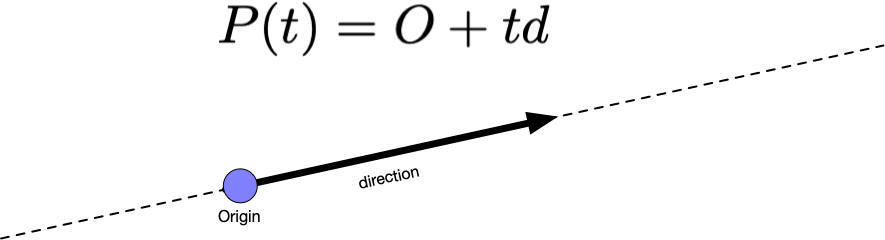

# Rendering the Sky

At the start of the semester our goal was to learn enough C++ to write a program that could generate beautiful images. In this exercise, we shall apply our mathematical knowledge and our problem solving know how to write a program that draws a very beautiful sky.

Our sky will consist of two colors. One color we'll call `sky_top` and the other color we will call `sky_bottom`. An example sky image is the one below.


Notice that at the top of the image the sky is a purplish blue color ([Pantone](https://en.wikipedia.org/wiki/Pantone) [291 U](https://www.pantone.com/color-finder/291-U)) and the bottom of the image the color is white. We can express the color at the top of the image as the the RGB color (127, 190, 235) where each channel has a value between 0 and 255. Alternatively, we can write the same color as three floating point numbers as (0.4980392156862745, 0.7450980392156863, 0.9215686274509803) where each channel has a value between 0 and 1. In case it isn't clear, the integer values of each channel divided by 255 yield the floating point equivalent, (127/255, 190/255, 235/255). And Remember that white is (255, 255, 255) or (1.0, 1.0, 1.0).

Notice that the sky smoothely transitions between the color at the top and the color at the bottom.


Changing the colors at the top and bottom a little bit can yield a sky that looks like the sun is setting. Unfortunately, we don't know how to draw the sun yet but we can draw the sky.

The objective of this assignment is to gain familiarity with the underlying mechanics of how a ray tracer works to generate an image of an imaginary sky.

There are a number of header files included in this project which are all documented. (Use `make doc` to generate the documentation.)

## Files

* `ray.h` & `ray.cc`

Defines a ray class which is how we calculate what is visible along a line in space. You can think of a ray as a parametric equation for a line:


The ray is made up an origin _O_ and a direction _d_. You can reach any point along the line that a ray defines by plugging in the value of _t_ that corresponds to that point. 

* `rng.h` & `rng.cc`

This is the random number generator that we have used in previous exercises. There are some convenience functions defined in this module.

* `vec3.h` & `vec3.cc`

The Vec3 files define Vec3, and Point3. Each of these objects represent an important idea needed for ray tracing. We need Vec3 to help us calculate the spacial relationships between different things in space. We need Point3 to represent points in space such as where we are or where we are looking. Color is critical because we use this object to represent the colors we see in our image.

* `rt.cc`

This is our ray tracing application. The job this file plays is creating all the objects we need and putting them to work. First it opens an image file and gets it ready. Then it creates the neccessary variables to represent the camera (where you are standing and where you are looking) and the viewport (the size and shape of what you see throught the camera).

Once everything is set up and ready to go, we loop through every pixel of our image. At each pixel, we calculate _u_ and _v_.

Calculating _u_ and _v_ can seem somewhat mysterious. The variable _u_ represents how far along we are on a given scanline (row) and the variable _v_ represents how far down from the top of the image have we progressed. We can imagine that each of these variables represent a percentage or ratio.

When _u_ is at 0% or 0.0 it is at the beginning of a scanline. When _u_ is at 50% or 0.5, it is in the middle of a scanline. And when _u_ is at the end of a scanline it is at 100% or 1.0. The way we calculate this value is to count how many pixels we have in a scanline (row) and divide that by the image's width - 1. (We minus 1 because we start counting from 0.)

The value for _v_ is calculated similarly. Instead we count from the top how many scanlines have been completed. In our loop, we are starting _v_ from the bottom of the image and counting down meaning we are at 100% (1.0) when we start and we cound down to 0% (0.0).

Using _u_ and _v_ we generate rays which we then use to calculate the sky's color.

## Rays

You can think of a ray as a parametric equation for a line:


The ray is made up an origin _O_ and a direction _d_. You can reach any point along the line that a ray defines by plugging in the value of _t_ that corresponds to that point. 



Notice that given positive values of _t_, you can stretch the ray along the dashed line in the direction of the arrow. Given negative values of _t_, you can stretch the ray in the opposite direction of the arrow.

In `ray.cc`, you must implement the missing member functions. Since the Ray class is built on top of the Vec3 class, you'll find that you'll be reusing member functions from Vec3 to implement the Ray class.

## Ray Color

In order to calculate what color the ray sees, we first need to understand the geometry of what we are creating.


Our camera is at the origin (0, 0, 0) and the camera has it's own coordinate system labeled with an X, Y, and Z axis. The camera's coordinate system is labeled in the diagram and the arrows are pointing in the positive directions.

The camera is looking at the yellow dot along the negative Z axis. The yellow dot is in the image plane. The image plane is what the camera sees and what we have to do is translate what it sees into an image.

Let's image the image plane is broken up into a grid. Each cell in the grid represents a pixel. You can imagine that the center of one of these pixels is the red dot in the image. We must know what the color is at the red dot.

To do this, we need a ray that starts at the origin and points at the red dot. We already know the origin (that's (0, 0, 0)). To calculate the ray, we need to start from the lower left corner of the image plane, walk _u_ units in the horizontal direction (the X direction), then walk _v_ units in the vertical direction (the Y direction). In other words:

```c++
Vec3 point_in_image_plane = kLowerLeftCorner + u * kHorizontal + v * kVertical;
```

To find the direction vector, you take the difference between the point in the image and where you are looking from (the origin).

```c++
Ray r(kOrigin, point_in_image_plaen - kOrigin);
```

Once you have the ray, you use the `RayColor()` function to calculate the color.

In `RayColor()`, define two colors, `sky_top` and `sky_bottom`. To find the color we first need to convert the ray's direction vector to a unit direction vector using `UnitVector()`.

Since we are interested in changing the color from the top of the image to the bottom of the image, note that this aligns to the Y axis of our camera. Therefore, we should use the Y component of our ray's direction vector to scale the colors in our image.

A unit vector has components with values between -1 and 1. Using the following formulas to move the values between 0 and 1.
```
Vec3 unit_direction = UnitVector(r.direction());
double t = 0.5 * (unit_direction.y() + 1.0);
```

To have the color vary from top to bottom, we can use the formula:
```c++
ColorRGB c = (1.0 - t) * sky_bottom + t * sky_top;
```
What this says is that as _t_ increases, there will be less `sky_bottom` color and more `sky_top` color. If _t_ decreases, there will be more `sky_bottom` color and less `sky_top` color.


## Requirements

Complete the program such that it creates an output image file of an imaginary sky. Select appropriate values for `sky_bottom` and `sky_top`.

Complete any `TODO` comments found in the project.

Close any file streams that you open and report any errors encountered.

To compile your program, you use the `make` command. A Makefile is provided for this exercise.

The Makefile has the following targets:
  
* all: builds the project
* clean: removes object and dependency files
* spotless: removes everything the clean target removes and all binaries
* format: outputs a [`diff`](https://en.wikipedia.org/wiki/Diff) showing where your formatting differes from the [Google C++ style guide](https://google.github.io/styleguide/cppguide.html)
* lint: output of the [linter](https://en.wikipedia.org/wiki/Lint_(software)) to give you tips on how to improve your code
* header: check to make sure your files have the appropriate header
* test: run tests to help you verify your program is meeting the assignment's requirements. This does not grade your assignment.
* unittest: run unit tests to verify parts of your program performs according to the instructor supplied unit tests.

## Inline Documentation
The project is thoroughly documented inline using the [Doxygen](https://en.wikipedia.org/wiki/Doxygen) format. The documentation establishes a framework for you to follow so that you can implement all the details of the program. To generate HTML formatted documents to view on your computer use the make target `doc`.

The inline documentation is saved in `doc/html`. To view the documentation, use the command `gio open doc/html/index.html` which will open the index file in your web browser.

Then you can install `doxygen` using the command `sudo apt install doxygen doxygen-latex graphviz`.

## Don't Forget

Please remember that:

- You need to put a header in every file.
- You need to follow the [Google C++ Style Guide](https://google.github.io/styleguide/cppguide.html).
- Remove the `TODO` comments.

## Testing Your Code

Computers only ever do exactly what they are told, exactly the way they are told it, and never anything else. Testing is an important process to writing a program. You need to test for the program to behave correctly and test that the program behaves incorrectly in a predictable way.

As programmers we have to remember that there are a lot of ways that we can write the wrong program and only one to a few ways to write the correct program. We have to be aware of [cognitive biases](https://en.wikipedia.org/wiki/List_of_cognitive_biases) that we may exercise that lead us to believe we have correctly completed our program. That belief may be incorrect and our software may have errors. [Errors in software](https://www.wired.com/2005/11/historys-worst-software-bugs/) may lead to loss of [life](https://www.nytimes.com/2019/03/14/business/boeing-737-software-update.html), [property](https://en.wikipedia.org/wiki/Mariner_1), [reputation](https://en.wikipedia.org/wiki/Pentium_FDIV_bug), or [all of the above](https://en.wikipedia.org/wiki/2009%E2%80%9311_Toyota_vehicle_recalls).

### Test strategy

Start simple, and work your way up. Good tests are specific, cover a broad range of fundamentally different possibilities, can identify issues quickly, easily, and directly, without need for much set up, and can almost be diagnosed by inspection if the code fails to execute the test correctly.

## Example Output

Please ensure your program's output is identical to the example below.

```
$ make unittest
set -e; clang++ -MM -g -O3 -Wall -pipe -std=c++17  -D LINUX -I/usr/include/GraphicsMagick -D AMD64 utilities.cc \
| sed 's/\(utilities\)\.o[ :]*/\1.o utilities.d : /g' > utilities.d; \
[ -s utilities.d ] || rm -f utilities.d
set -e; clang++ -MM -g -O3 -Wall -pipe -std=c++17  -D LINUX -I/usr/include/GraphicsMagick -D AMD64 vec3.cc \
| sed 's/\(vec3\)\.o[ :]*/\1.o vec3.d : /g' > vec3.d; \
[ -s vec3.d ] || rm -f vec3.d
set -e; clang++ -MM -g -O3 -Wall -pipe -std=c++17  -D LINUX -I/usr/include/GraphicsMagick -D AMD64 rt.cc \
| sed 's/\(rt\)\.o[ :]*/\1.o rt.d : /g' > rt.d; \
[ -s rt.d ] || rm -f rt.d
set -e; clang++ -MM -g -O3 -Wall -pipe -std=c++17  -D LINUX -I/usr/include/GraphicsMagick -D AMD64 rng.cc \
| sed 's/\(rng\)\.o[ :]*/\1.o rng.d : /g' > rng.d; \
[ -s rng.d ] || rm -f rng.d
set -e; clang++ -MM -g -O3 -Wall -pipe -std=c++17  -D LINUX -I/usr/include/GraphicsMagick -D AMD64 ray.cc \
| sed 's/\(ray\)\.o[ :]*/\1.o ray.d : /g' > ray.d; \
[ -s ray.d ] || rm -f ray.d
rm: cannot remove 'unittest': No such file or directory
make: [Makefile:132: cleanunittest] Error 1 (ignored)
rm: cannot remove '*_unittest.o': No such file or directory
make: [Makefile:133: cleanunittest] Error 1 (ignored)
clang++ -g -O3 -Wall -pipe -std=c++17  -D LINUX -I/usr/include/GraphicsMagick -D AMD64 -c vec3.cc
clang++ -g -O3 -Wall -pipe -std=c++17  -D LINUX -I/usr/include/GraphicsMagick -D AMD64 -c vec3_unittest.cc
clang++ -g -O3 -Wall -pipe -std=c++17  -D LINUX -I/usr/include/GraphicsMagick -D AMD64 -c ray.cc
clang++ -g -O3 -Wall -pipe -std=c++17  -D LINUX -I/usr/include/GraphicsMagick -D AMD64 -c ray_unittest.cc
clang++ "" -g -O3 -Wall -pipe -std=c++17 -lGraphicsMagick++ -o unittest vec3.o vec3_unittest.o ray.o ray_unittest.o -lgtest -lgtest_main -lpthread
./unittest
Running main() from /build/googletest-j5yxiC/googletest-1.10.0/googletest/src/gtest_main.cc
[==========] Running 23 tests from 2 test suites.
[----------] Global test environment set-up.
[----------] 19 tests from Vec3Test
[ RUN      ] Vec3Test.GetX
[       OK ] Vec3Test.GetX (0 ms)
[ RUN      ] Vec3Test.GetY
[       OK ] Vec3Test.GetY (0 ms)
[ RUN      ] Vec3Test.GetZ
[       OK ] Vec3Test.GetZ (0 ms)
[ RUN      ] Vec3Test.UnaryMinus
[       OK ] Vec3Test.UnaryMinus (0 ms)
[ RUN      ] Vec3Test.Size
[       OK ] Vec3Test.Size (0 ms)
[ RUN      ] Vec3Test.SubscriptOperator
[       OK ] Vec3Test.SubscriptOperator (0 ms)
[ RUN      ] Vec3Test.Length
[       OK ] Vec3Test.Length (0 ms)
[ RUN      ] Vec3Test.LengthSquared
[       OK ] Vec3Test.LengthSquared (0 ms)
[ RUN      ] Vec3Test.PlusOperator
[       OK ] Vec3Test.PlusOperator (0 ms)
[ RUN      ] Vec3Test.MinusOperator
[       OK ] Vec3Test.MinusOperator (0 ms)
[ RUN      ] Vec3Test.MultiplicationOperator
[       OK ] Vec3Test.MultiplicationOperator (0 ms)
[ RUN      ] Vec3Test.DivisionOperator
[       OK ] Vec3Test.DivisionOperator (0 ms)
[ RUN      ] Vec3Test.Equality
[       OK ] Vec3Test.Equality (0 ms)
[ RUN      ] Vec3Test.Inequality
[       OK ] Vec3Test.Inequality (0 ms)
[ RUN      ] Vec3Test.Dot
[       OK ] Vec3Test.Dot (0 ms)
[ RUN      ] Vec3Test.Cross
[       OK ] Vec3Test.Cross (0 ms)
[ RUN      ] Vec3Test.UnitVector
[       OK ] Vec3Test.UnitVector (0 ms)
[ RUN      ] Vec3Test.Reflect
[       OK ] Vec3Test.Reflect (0 ms)
[ RUN      ] Vec3Test.StreamInsertionOperator
[       OK ] Vec3Test.StreamInsertionOperator (0 ms)
[----------] 19 tests from Vec3Test (0 ms total)

[----------] 4 tests from RayTest
[ RUN      ] RayTest.GetOrigin
[       OK ] RayTest.GetOrigin (0 ms)
[ RUN      ] RayTest.GetDirection
[       OK ] RayTest.GetDirection (0 ms)
[ RUN      ] RayTest.At
[       OK ] RayTest.At (0 ms)
[ RUN      ] RayTest.StreamInsertionOperator
[       OK ] RayTest.StreamInsertionOperator (0 ms)
[----------] 4 tests from RayTest (0 ms total)

[----------] Global test environment tear-down
[==========] 23 tests from 2 test suites ran. (1 ms total)
[  PASSED  ] 23 tests.
$ make
clang++ -g -O3 -Wall -pipe -std=c++17  -D LINUX -I/usr/include/GraphicsMagick -D AMD64 -c rng.cc
clang++ -g -O3 -Wall -pipe -std=c++17  -D LINUX -I/usr/include/GraphicsMagick -D AMD64 -c rt.cc
clang++ -g -O3 -Wall -pipe -std=c++17  -D LINUX -I/usr/include/GraphicsMagick -D AMD64 -c utilities.cc
clang++ -g -O3 -Wall -pipe -std=c++17 -lGraphicsMagick++ -o rt ray.o rng.o rt.o vec3.o utilities.o 
$ ./rt
Please provide a path to a file.
$ ./rt blue_sky.png
Your image has 512 columns (x direction) and 288 rows (y direction).
Time elapsed: 0.0911893 seconds.
```
